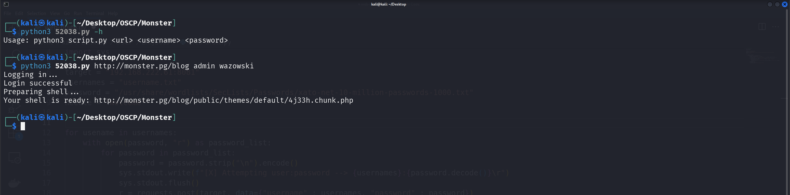
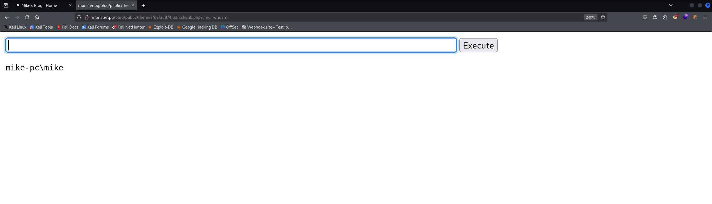

The is a modified exploit from exploitdb 52038.
Already tested against monstra 3.0.4 version from offsec PG practice machine monster. 
This exploit abuse the function of theme adding on the administration panel, by adding a input field with php code, we can create a webshell on the theme directory.

